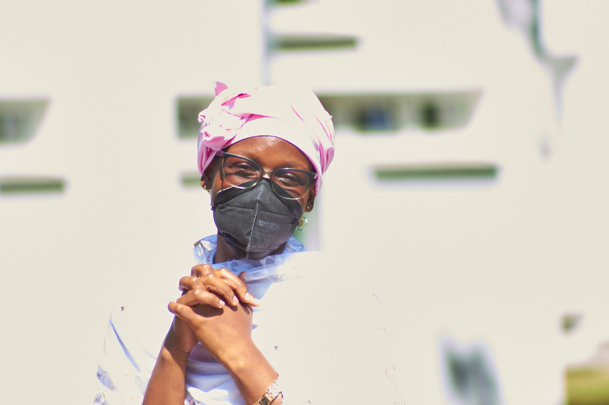

Twitter:[@abemgnigni](https://twitter.com/abemgnigni)

LinkedIn:[Marianne ABEMGNIGNI NJIFON](https://www.linkedin.com/in/marianne-abemgnigni-njifon-931142150/)

Email: nabemgnigni at aimsammi dot org

### About me
I am a PhD Student at the University of Goettingen working on **Graph Convolutional Networks** and **Spatial Inference**. I am honoured to be supervised by [Pr. Dominic Schuhmacher](http://www.dominic.schuhmacher.name/) in the [RTG2088](https://www.uni-goettingen.de/en/514290.html) research group. I am interested in developing Graph-based machine learning methods and investigating their mathematical foundations as well as their robustness and Interpretability. I am currently working on applications using Spatial data.

Previously I was an AI Resident in the [Google Brain Accra Lab]((https://research.google/locations/accra/)) where I worked on frequency analysis to improve the robustness of Deep Neural Networks. I also  was a research intern in the Deep Learning Embedded group at [DeepMind](https://www.deepmind.com/) in London. I was part of the first cohort of the [African Master's of Machine Intelligence](https://nexteinstein.org/aims-launches-first-of-its-kind-african-masters-in-machine-intelligence-at-rwanda-campus/) in Rwanda. Before that, I completed the AIMS Cameroon Master's in Mathematical Sciences as a [Mastercard Foundation Scholar](https://mastercardfdn.org/all/scholars/), where I graduated with honours and as the second best female student. I hold a Master in Physics from the University of Yaounde I. 

In addition to Machine Learning research, I am passionate about Physics, especially Nonlinear Optics. I am currenly investigating the propagation of Few-cycle pulses in magnetic and non-magnetic materials with my mentor [Pr. Kofane Timoleon Crepin](https://www.researchgate.net/profile/Timoleon-Crepin-Kofane), at the University of Yaounde I . Please check out our paper on this [topic](https://opg.optica.org/josab/abstract.cfm?uri=josab-37-11-a331) that was published in the Journal of Optical Society of America.

Outside of research, I am an advocate for promoting the study of AI and STEM by underrepresented communities, especially in Africa. I am co-lead of [Bel's AI Initiative](https://www.linkedin.com/company/79720797) which conducts outreach about AI in Central Africa with a focus on rural areas. I serve as a mentor to Bel's AI members. I am part of the [WIMLDS Yaounde chapter](http://wimlds.org/about-the-yaounde-team-2/), and co-organiser of [KMERAI](https://sites.google.com/view/kmerai-2021/home?authuser=0) events.

**If you would like to connect, please reach out at: nabemgnigni at aimsammi dot org**

### News
  - I was thrilled to be part of the program comittee at the Neurips 2022 [Interpolate workshop](https://sites.google.com/view/interpolation-workshop?pli=1), [AFCP workshop](https://www.afciworkshop.org/) and [BAI workshop](https://blackinai.github.io/#/workshop/bai2022).
  - It was a privilege to attend the wonderful [Probai](https://probabilistic.ai/) summer school in Helsinki.
  - Excited to share my interview about my experience with [wordsthatcount](https://wordsthatcount.org/women-in-machine-learning-abemgnigni-njifon-marianne/)
  - It was an honour to present my Physics works as an Invited Speaker at the Third Global Summit on Physics, GSP 2021.
  - It was a pleasure to give a talk at IndabaX Zimbambwe, 2021
  - I was thrilled to speak about the Pro's and Con's of AI in Healthcare, at the KMERAI workshop, 2021.
  - Excited to start my PhD with Pr. Dominic Schuhmacher, in the Research training group RTG2088 at the University of Goettingen, Germany.
  - I just wrapped my AI residency in the Brain team at the Google AI Accra Lab. Thank you to my incredible mentor [Yann Dauphin](https://www.dauphin.io/), and to all my colleagues.
  - It was great spending the past three months in the Deep Learning Embedded group at Deepmind as a Research Intern. I worked on Instance Segmentation and learned a lot from my mentor [Aidan Clark](https://www.linkedin.com/in/aidan-b-clark/).

### Publications
   - [Robustmix: Improving Robustness by Regularizing the Frequency Bias of Deep Nets](https://openreview.net/pdf?id=Na64z0YpOx),  Jonas Ngnawe(*), **Marianne ABEMGNIGNI NJIFON(*)**, Jonathan Heek, Yann Dauphin, Accepted at the Neurips 2022 workshop on Distribution Shifts: Connecting Methods and Applications. ((*) stands for equal contribution.)
   - [Few-cycle optical pulses in negative index materials with dispersive permittivity and permeability](https://opg.optica.org/josab/abstract.cfm?uri=josab-37-11-a331),  **Marianne ABEMGNIGNI NJIFON**, Conrad Bertrand TABI, Timoleon Crepin KOFANE, vol. 37, No. 11, Journal of the Optical Society of America B, 2020.

 
  
  

